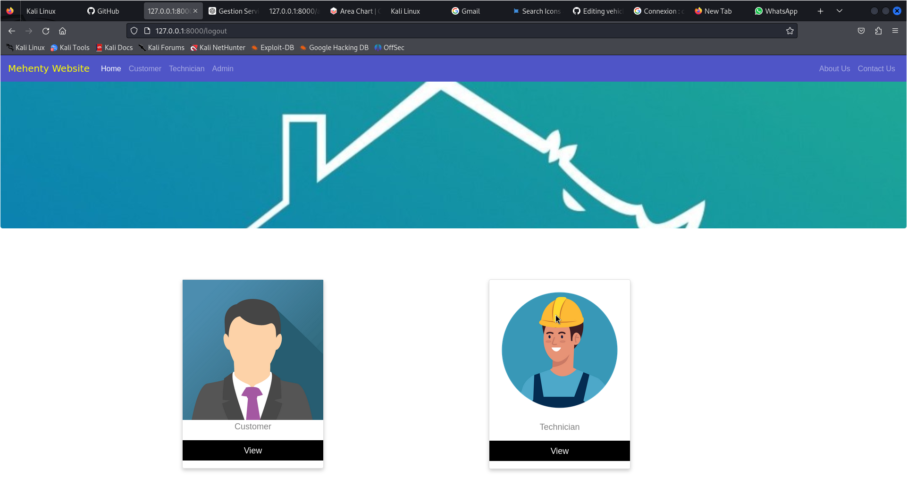
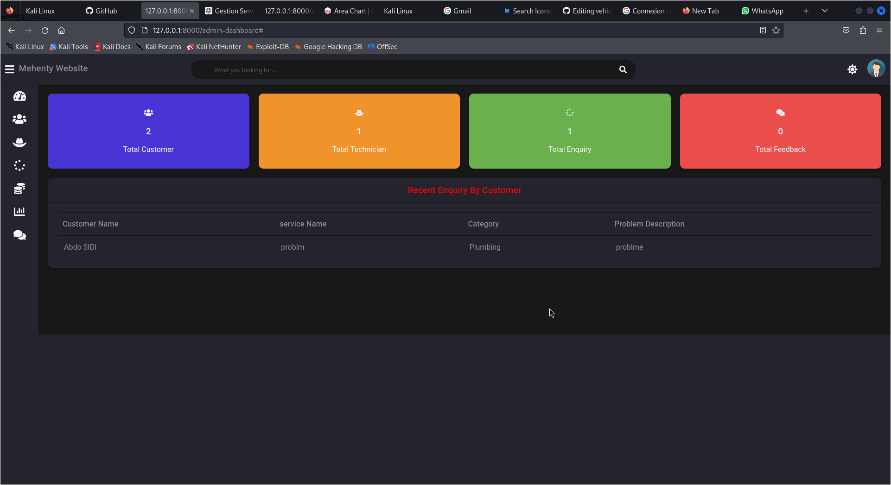
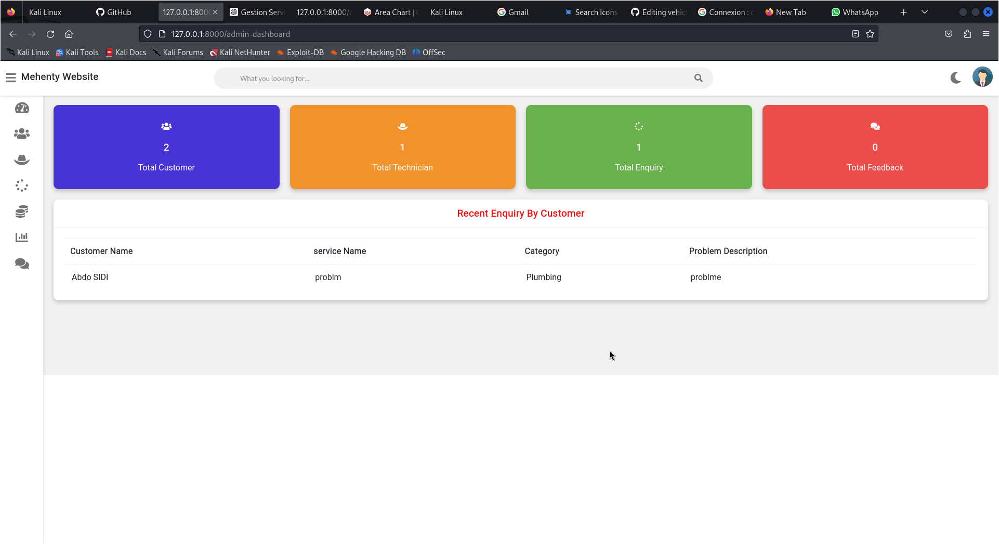
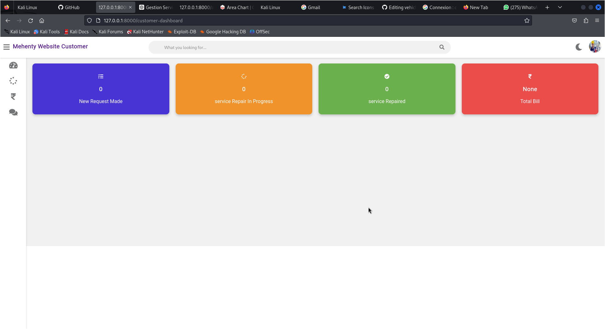

# MEHENTY WEBSITE IRT GROUPE 2 :
## Membres de l'Équipe
- **Chef d'Équipe :**
  - Ahmed Abd Dayme Ahmed Bouha 23243
- **Membres de l'Équipe :**
  - Moussa Ba 23043
  - Aichetou mouhssen 23104
---------------------------------------------------------

## Lien vers le Projet GitHub

[Projet GitHub - Application PEI](https://github.com/ahmedirt/mehenty_irt)


## CAPTURES D'ÉCRAN
### Page d'accueil

### Tableau de bord administrateur en thème sombre

### Tableau de bord administrateur en thème clair

### Tableau de bord technicien

### Tableau de bord client



## FONCTIONS
## Client
- Le client s'inscrit et se connecte au système
- Le client peut demander un service pour son service en fournissant des détails (numéro de service, modèle, description du problème, etc.)
- Après l'approbation de la demande par l'administrateur, le client peut vérifier le coût et l'état du service
- Le client peut supprimer une demande (Enquête) si le client change d'avis ou si elle n'est pas approuvée par l'administrateur (SEULEMENT LES DEMANDES EN ATTENTE PEUVENT ÊTRE SUPPRIMÉES)
- Le client peut vérifier l'état de la demande (Enquête) qui est En attente, Approuvée, En réparation, Réparation terminée, Libérée
- Le client peut vérifier les détails de la facture ou des services réparés
- Le client peut envoyer des commentaires à l'administrateur
- Le client peut voir/éditer son profil
---
## Technicien
- Le technicien postule pour un emploi en fournissant des détails tels que (compétences, adresse, téléphone, etc.)
- L'administrateur embauchera (approuvera) le compte du technicien en fonction de ses compétences
- Après l'approbation du compte, le technicien peut se connecter au système
- Le technicien peut voir combien de travaux (services à réparer) lui sont assignés
- Le technicien peut changer l'état du service ('En réparation', 'Réparation terminée') selon l'avancement des travaux
- Le technicien peut voir son salaire et combien de services il/elle a réparés jusqu'à présent
- Le technicien peut envoyer des commentaires à l'administrateur
- Le technicien peut voir/éditer son profil
---
### Administrateur
- Tout d'abord, l'administrateur se connectera (pour nom d'utilisateur/mot de passe, exécutez la commande suivante dans cmd)
```
py manage.py createsuperuser
```
- Donnez le nom d'utilisateur, l'e-mail, le mot de passe et votre compte administrateur sera créé.
- Après la connexion, l'administrateur peut voir combien de clients, techniciens, de nouvelles commandes de service récentes sur le tableau de bord
- L'administrateur peut voir/ajouter/mettre à jour/supprimer des clients
- L'administrateur peut voir chaque facture client (si deux demandes sont faites par le même client, elle affichera la somme totale des deux demandes)
- L'administrateur peut voir/ajouter/mettre à jour/supprimer des techniciens
- L'administrateur peut approuver (embaucher) des techniciens (demandés par le technicien) en fonction de leurs compétences
- L'administrateur peut voir/mettre à jour le salaire du technicien
- L'administrateur peut voir/mettre à jour/supprimer la demande/l'enquête de service envoyée par le client
- L'administrateur peut également faire une demande de service (supposons que le client se rende directement au centre de service/bureau)
- L'administrateur peut approuver la demande de service faite par le client et l'assigner au technicien pour la réparation en fournissant le coût en fonction de la description du problème
- L'administrateur peut voir tous les coûts de service de la demande (approuvée et en attente)
- L'administrateur peut voir les commentaires envoyés par le client/le technicien
---
### Autres fonctionnalités
- Nous pouvons changer le thème du site web en jour (blanc) et nuit (noir)
- Si un client est supprimé par l'administrateur, sa demande (Enquête) sera automatiquement supprimée
## COMMENT EXÉCUTER CE PROJET

